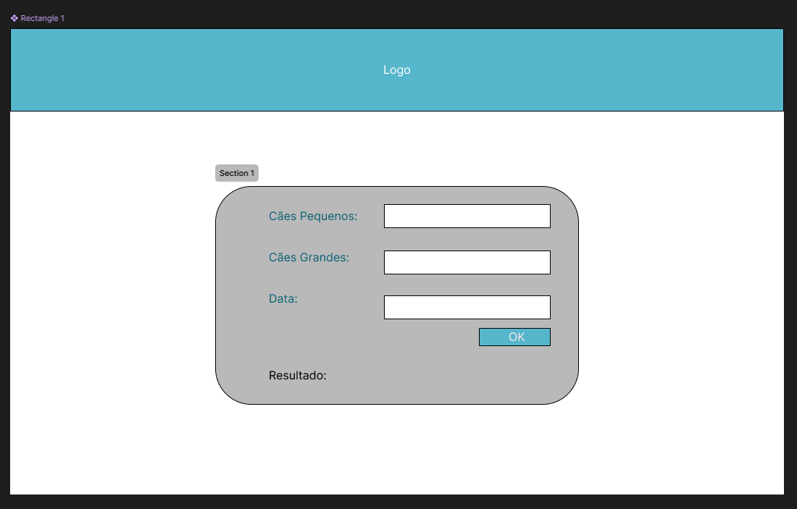
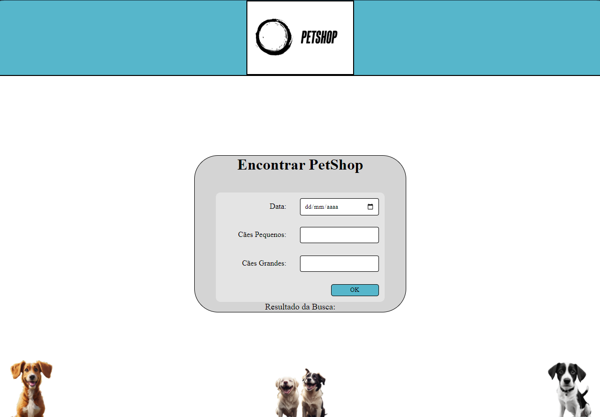
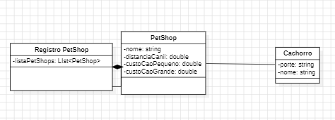
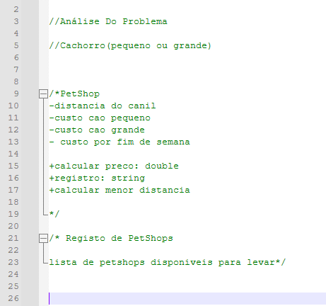

<h2 align="center">🐶 PETSHOP 🐶</h2>

> Projeto feito para ajudar Eduardo a encontrar o melhor PetShop perto de seu canil.

## 💻 Instruções para executar o sistema

A seguir, as instruções para executar o sistema:

1. Clone o repositório. `git clone https://github.com/NocceV/-petshop_DTI.git`
2. Abra o Visual Studio Code.
3. No Visual Studio Code vá até: `"File" (Arquivo) > "Open Folder" (Abrir Pasta).`
4. Navegue até o diretório onde o repositório foi clonado e selecione a pasta principal do projeto.
5. No visual Studio Code, abra o arquivo `index.html'`
6. Tenha uma extenção de Preview instalada no Visual Studio `Live Server por exemplo.`
7. Com a extensão instalada, abra o arquivo utilizando a funcionalidade de pré-visualização do Live Server.

## 📒 Premissas assumidas

Lista de condições assumidas para o desenvolvimento do projeto:

- **Usuário:** O usuário final seria Eduardo.
- **Objetivos do usuário:** Encontrar o melhor PetShop para a quantidade de cães que o usuário quer dar banho.
- **Tecnologia de Acesso:** Navegador Web e/ou Dispositivo móvel.
- **Dados:** Os três PetShops próximos do canil de Eduardo, cada um com uma distância e preços diferentes de acordo com o dia da semana.
- **Cronograma:** 2 dias de planejamento e desenvolvimento.

## 🤖 Decisões de projeto

# **Front-end:**

- Para o desenvolvimento front-end, foi decidido usar as tecnologias HTML e CSS, com responsividade.
    
- **Esboço no Figma:**
  

- **Versão Final do Projeto:**
  

# **Back-end**:

- Para o desenvolvimento do back-end foi escolhido usar a linguagem JavaScript.
- Inicialmente foram utilizadas as ferramentas: StarUML e NotePad++ para o desenho do projeto.
- Logo após, primeiramente foi feito um código funcional, porém simples como protótipo.
- No final, o código foi refatorado, ficando  mais flexível e adaptado para futuras extenções usando conceitos de orientação à objetos.

  
> Analise do problema usando UML.

  
> Analise do problema usando notePad++.

## 🧩 Tecnologias Utilizadas

- Git
- GitHub
- HTML
- CSS
- JavaScript
- NotePad++
- StarUML
- Figma
- C#

 ## 👾 Extra: 

 - Como diversão, também foi feito o mesmo sistema em C#. Para acessa-lo basta seguir o link
 -   ``

